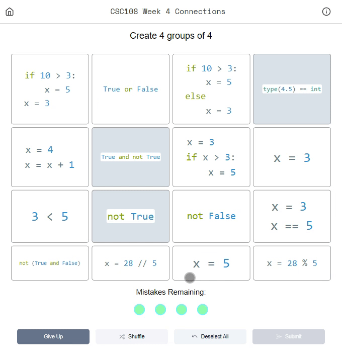

# CS Connections

CS Connections is an adaptation of the popular New York Times [Connections puzzle game](https://www.nytimes.com/games/connections) designed specifically for use in the classroom. This tool allows instructors to create and share custom puzzles that help students **recognize patterns, develop problem-solving skills, and reinforce concepts** in an engaging way.

You can access the tool online at **[cs-connections.app](https://cs-connections.app)**.

# How the game works

CS Connections is an association game where players categorize elements into groups, based on a common theme. Players select elements they believe belong together, and if correct, the category is revealed. Otherwise, they receive a strike, with a maximum of four incorrect attempts before the game ends. The goal is to identify all correct categories before running out of strikes.

# Example Game

# Instructor Game Creation

Instructors interested in having a course set up on the app can contact ethan.fong@mail.utoronto.ca

# Motivation & Features

Other NYT Connections-inspired creation tools exist. However, these tools lack important features necessary to support puzzles revolving around computing concepts. Below is a summary of the features we wanted:

| **Required Feature**                                      | **Reasoning** |
|----------------------------------------------------------|--------------|
| The ability to customize grid size (M categories of size N) | Allows instructors to fit larger individual elements in a game and supports more flexible game creation. |
| Support for lowercase letters | Coding languages like Python are case-sensitive, so capitalization is critical to represent code clearly. |
| Support for special characters such as commas | These are essential for representing valid code syntax as elements. |
| Use of whitespace characters such as newlines and tabs | These are essential for allowing longer code snippets as elements. |
| Prerequisite information field | Helps present variable initializations or assumptions concisely. |
| Data collection on guesses and categories | Provides insights into student performance and common challenges. |

Other features that make this connections app stand out:

- Homepage to organize games by course

- Student game creation portal

- Instructor explanations for categories

- Statistics view

# Self Hosting Information

If instructors would like to host the webapp themselves (thus allowing full control over the data collected), please clone the repositories below and use your own webserver to host the app. Note that you will need to connect a database to the backend, which is currently set up to use Postgres.

# Dev information & Contributing

In order to run the codebase locally, you need to clone two repositories:

1. [frontend repo](https://github.com/ethan-fong/cs-connections)

2. [backend repo](https://github.com/ethan-fong/connections-backend)

Then in both repositories, use the rundev.sh script to set up a local copy of the app. Note that it will use ports 1235 and 8080. You may adjust the rundev scripts if you want to use other ports.

You can then access the frontend at localhost:1235.

- Please fork and submit a PR if you'd like to contribute to this app! Changes to the main branch are synced and made live daily.

# Acknowledgements

The frontend for CS-Connections is a fork of the react-connections-game by and-computers repo found at: [repo](https://github.com/and-computers/react-connections-game)